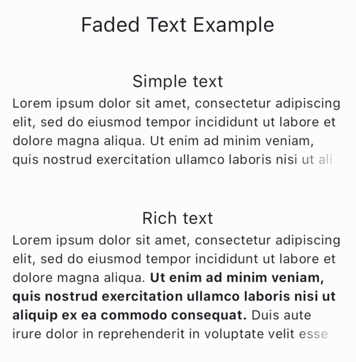
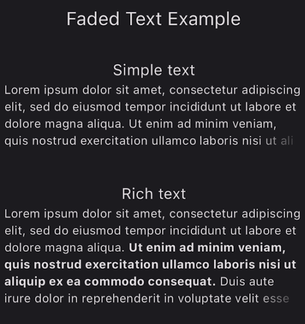

<p align="center">

</p>

# Overview 🐄 

Faded Text is a package that allows you to create a fading text in case of overflow. If the text is overflow, it will look like this:

<p align="center">
 
 
</p>

Otherwise it will look like plain text.


## Installation 

Add `faded_text` to your `pubspec.yaml` file:

```yaml
dependencies:
  faded_text: $currentVersion$
```

<p>At this moment, the current version of <code>faded_text</code> is <a href="https://pub.dev/packages/faded_text"></a>.</p>

## Example

You need to create an instance of the `FadedText` class like a regular `Text`. The text will overflow according to `maxLines`, which by default corresponds to 1.

```dart
  FadedText(
    'Lorem ipsum dolor sit amet, consectetur adipiscing elit, sed do eiusmod tempor incididunt ut labore et dolore magna aliqua. Ut enim ad minim veniam, quis nostrud exercitation ullamco laboris nisi ut aliquip ex ea commodo consequat. Duis aute irure dolor in reprehenderit in voluptate velit esse cillum dolore eu fugiat nulla pariatur. Excepteur siƒnt occaecat cupidatat non proident, sunt in culpa qui officia deserunt mollit anim id est laborum',
    maxLines: 5,
  )
```

You can also create `FadedText.rich` like regular `Text.rich`.

```dart
  FadedText.rich(
    TextSpan(
      children: [
        TextSpan(
          text:
            'Lorem ipsum dolor sit amet, consectetur adipiscing elit, sed do eiusmod tempor incididunt ut labore et dolore magna aliqua. '),
          TextSpan(
            text:
              'Ut enim ad minim veniam, quis nostrud exercitation ullamco laboris nisi ut aliquip ex ea commodo consequat.',
              style: TextStyle(fontWeight: FontWeight.bold),
          ),
        ],
      ),
    maxLines: 4,
  )
```

## Changelog

All notable changes to this project will be documented in [this file](./CHANGELOG.md).

## Issues

To report your issues, file directly in the [Issues](https://github.com/surfstudio/faded-text/issues) section.

## Contribute

If you would like to contribute to the package (e.g. by improving the documentation, fixing a bug or adding a cool new feature), please read our [contribution guide](./CONTRIBUTING.md) first and send us your pull request.

Your PRs are always welcome.

## How to reach us

Please feel free to ask any questions about this package. Join our community chat on Telegram. We speak English and Russian.

[](https://t.me/SurfGear)

## License

[Apache License, Version 2.0](https://www.apache.org/licenses/LICENSE-2.0)